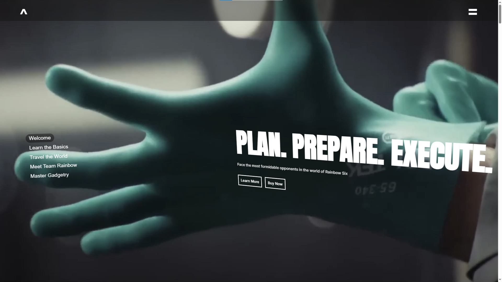

# Rainbow Six: Siege Microsite

A static themed microsite inspired by Rainbow Six, presenting its core features with a product launch experience. Made to practice HTML/CSS/JS and mimic a product launch landing page that introduces players to the game's unique characters, gameplay, and  world design. Built using HTML, CSS, JavaScript, and Next.js and deployed using Vercel.

## Preview

[rainbowsix-project.vercel.app](https://rainbowsix-project.vercel.app)

